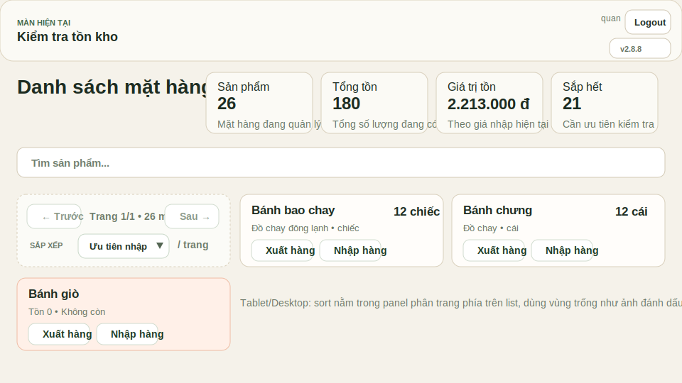
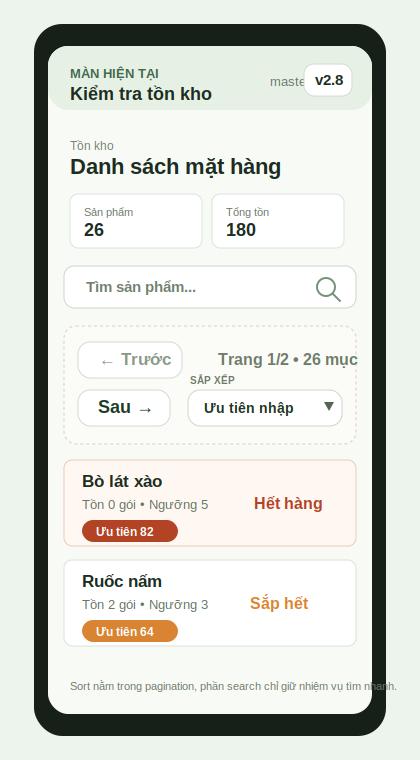

# Issue 70 - Plan Design Cho Sắp Xếp Tồn Kho

Nguồn gốc:

- GitHub issue: `#70`
- URL: <https://github.com/quantum-bluesky/quanlythucphamchay/issues/70>

## 1. Tóm tắt yêu cầu

Màn `TK` cần có dropdown sắp xếp list hàng tồn theo các tiêu chí:

1. `Số lượng tồn`: cao -> thấp
2. `Giá trị tồn`: cao -> thấp
3. `Độ ưu tiên`: dựa trên sức bán gần đây + mức thiếu hàng
4. `Hạn dùng còn lại`: ít -> nhiều

Issue cũng yêu cầu mở rộng file master `CSV` của `products` khi import/export ở `Master Admin` để có thêm:

- `thời hạn sử dụng sản phẩm`
- `thời gian bảo quản sản phẩm`

## 2. Khảo sát hiện trạng

### Frontend

- Màn `inventory` hiện chỉ có search, chưa có sort control.
- `static/modules/ui/inventory-ui.js` đang lọc theo `state.searchTerm` rồi render trực tiếp.
- `state` chưa có field lưu sort mode cho `inventory`.
- Màn `products` và form tạo/sửa sản phẩm chưa có field về hạn dùng hoặc thời gian bảo quản.

### Backend

- Bảng `products` mới có:
  - `name`
  - `category`
  - `unit`
  - `price`
  - `sale_price`
  - `low_stock_threshold`
- `get_products()` mới trả tồn hiện tại và giá trị tồn suy ra từ `price`.
- Import/export master `CSV` cho `products` mới có 6 cột:
  - `name`
  - `category`
  - `unit`
  - `price`
  - `sale_price`
  - `low_stock_threshold`

### Dữ liệu nghiệp vụ

- App hiện chưa quản lý tồn kho theo lô nhập.
- Không có mapping chuẩn giữa `current_stock` và từng lô còn hạn bao nhiêu ngày.
- Vì vậy, sort theo `hạn dùng còn lại` hiện chỉ làm chính xác ở mức `ước tính theo sản phẩm`, chưa phải `expiry thật theo lot/FIFO`.

## 3. Quyết định design đề xuất

## 3.1. Phạm vi thực hiện cho Issue 70

Thực hiện theo hướng `patch nhỏ, tương thích ngược, không đổi workflow kho lõi`:

- thêm metadata ở `products`
- thêm metric suy diễn ở backend
- thêm dropdown sort ở `inventory`
- thêm field vào product form + admin CSV
- cập nhật tài liệu + test

Không mở rộng sang:

- quản lý tồn theo lô
- FIFO expiry thật
- chỉnh logic trừ kho theo hạn dùng từng lô

Ý nghĩa cụ thể:

- `quản lý tồn theo lô`: mỗi lần nhập hàng sẽ tạo một lô riêng có số lượng ban đầu, số lượng còn lại, ngày nhập, hạn dùng hoặc ngày hết hạn. Hiện app chỉ tính tồn tổng theo `product_id` từ bảng `transactions`, nên chưa biết 10 gói đang còn là từ lô nhập nào.
- `FIFO expiry thật`: khi xuất hàng, hệ thống phải biết lô nào được trừ trước, thường là lô nhập trước hoặc lô hết hạn trước. Muốn làm đúng cần ledger theo lô, không chỉ trừ tổng tồn sản phẩm.
- `chỉnh logic trừ kho theo hạn dùng từng lô`: checkout hiện chỉ tạo transaction `out` cho sản phẩm. Nếu theo lô, checkout phải chọn và trừ từng batch, cập nhật tồn còn lại theo batch và giữ audit chi tiết.

Kết luận: Issue 70 chỉ thêm khả năng `sắp xếp/ước tính ưu tiên` ở cấp sản phẩm. Nếu cần date thật theo từng lô, phải mở issue riêng vì đó là thay đổi workflow và schema kho.

## 3.2. Schema sản phẩm

Thêm 2 cột mới vào bảng `products`:

- `shelf_life_days REAL NULL`
- `storage_life_days REAL NULL`

Quy ước:

- `shelf_life_days`: số ngày hạn dùng chuẩn của sản phẩm
- `storage_life_days`: số ngày bảo quản ước tính nếu không có hạn dùng chuẩn

Rule dữ liệu:

- cho phép `NULL`
- giá trị nếu nhập phải `> 0`
- DB cũ migrate mềm, không backfill cưỡng bức

## 3.3. Rule tính `độ ưu tiên`

Công thức ban đầu dùng `sales_avg_base * 100 + shortage_ratio * 10 + out_of_stock_bonus` chưa đủ chuẩn để implement, vì `sales_avg_base` là số lượng tuyệt đối. Hai sản phẩm khác đơn vị hoặc khác ngưỡng tồn sẽ bị so sánh lệch.

Ví dụ:

- `Đậu hũ`: bán 30 hộp/tháng, ngưỡng tồn 60 hộp
- `Bò kho`: bán 8 gói/tháng, ngưỡng tồn 5 gói

Nếu chỉ nhìn số lượng `30 > 8`, `Đậu hũ` có vẻ ưu tiên hơn. Nhưng theo sức ép tồn kho, `Đậu hũ` mới bán `0.5 lần ngưỡng/tháng`, còn `Bò kho` bán `1.6 lần ngưỡng/tháng`, nên `Bò kho` có áp lực xoay vòng cao hơn.

### Chuẩn chung để so sánh

Dùng `priority_base_stock` làm đơn vị chuẩn chung cho từng sản phẩm:

```text
avg_monthly_out =
  nếu sales_6m_total > 0: sales_6m_total / 6
  ngược lại: sales_12m_total / 12

priority_base_stock = max(low_stock_threshold, avg_monthly_out, 1)
```

Sau đó mọi thành phần đều đổi về tỷ lệ không đơn vị:

```text
demand_pressure = clamp(avg_monthly_out / priority_base_stock, 0, 1)
shortage_pressure = clamp((priority_base_stock - current_stock) / priority_base_stock, 0, 1)
```

Hai chỉ số này cùng nằm trên thang `0..1` trong case phổ biến:

- `demand_pressure = 1`: mỗi tháng bán tương đương một mức tồn chuẩn
- `shortage_pressure = 1`: tồn hiện tại bằng 0 so với mức tồn chuẩn
- `0.5` ở bất kỳ sản phẩm nào đều nghĩa là một nửa mức tồn chuẩn của chính sản phẩm đó

### Công thức điểm ưu tiên chuẩn hóa

Đề xuất dùng tuyến tính trước để dễ kiểm chứng:

```text
priority_score = round(100 * ((demand_pressure + shortage_pressure) / 2), 2)
```

Sort:

- giảm dần theo `priority_score`
- nếu bằng nhau, ưu tiên `urgency_tier` cao hơn
- nếu vẫn bằng nhau, tồn thấp hơn đứng trước
- cuối cùng sort tên `A-Z`

`urgency_tier` chỉ là tie-break, không cộng hệ số tùy ý vào score:

```text
3 = hết hàng, current_stock <= 0
2 = sắp hết, current_stock <= low_stock_threshold
1 = dưới mức tồn chuẩn, current_stock < priority_base_stock
0 = an toàn
```

Lý do chọn công thức này:

- các sản phẩm được quy về cùng thang đo theo `priority_base_stock`
- cùng một giá trị áp lực cho cùng một mức ưu tiên, dù sản phẩm khác đơn vị tính
- không dùng hệ số tùy ý như `100`, `10`, `2` khi các thành phần chưa cùng chuẩn
- clamp về `0..1` để score luôn nằm trong thang `0..100`, dễ test và dễ đọc trên UI
- nếu sau này cần đường cong mềm hơn, có thể thay phần tuyến tính bằng cùng một hàm chuẩn hóa, ví dụ `1 - exp(-x)`, nhưng vẫn phải dùng chung `priority_base_stock`

Chỉ tính `sales_6m_total` và `sales_12m_total` từ giao dịch bán hàng thật:

- tính các transaction `out` có kind là `sale`
- không tính `supplier_return`
- không tính `inventory_adjustment`
- không tính các transaction out không xác định được là đơn bán, trừ khi code legacy hiện tại có rule nhận diện rõ từ note

## 3.4. Rule tính `hạn dùng còn lại`

Vì app chưa có tồn theo lô, dùng rule `ước tính theo lần nhập gần nhất có ý nghĩa`:

1. Tìm `last_purchase_inbound_at` của sản phẩm:
   - ưu tiên receipt loại `purchase`
   - fallback về transaction `in` gần nhất nếu không có purchase receipt
2. Tính `days_since_inbound`
3. Tính `estimated_remaining_days`:
   - nếu có `shelf_life_days`: `shelf_life_days - days_since_inbound`
   - nếu không có `shelf_life_days` nhưng có `storage_life_days`: `storage_life_days - days_since_inbound`
   - nếu cả hai đều thiếu: `NULL`

Quy ước sort:

- `estimated_remaining_days` tăng dần
- sản phẩm không đủ dữ liệu (`NULL`) đẩy xuống cuối
- nếu bằng nhau thì sort theo tên

Lưu ý nghiệp vụ:

- đây là `ước tính độ gấp về hạn`
- không phải hạn dùng chính xác cho từng lô tồn
- nếu sau này cần chính xác thật, phải mở phase mới cho `lot-level inventory`

## 3.5. Derived metrics trả về cho client

Mở rộng payload product từ backend để client không phải tự tính từ transaction:

- `inventory_value`
- `sales_6m_total`
- `sales_6m_avg`
- `sales_12m_total`
- `sales_12m_avg`
- `priority_base_stock`
- `demand_pressure`
- `shortage_pressure`
- `priority_score`
- `urgency_tier`
- `last_purchase_inbound_at`
- `estimated_remaining_days`
- `expiry_basis`
  - `shelf_life`
  - `storage_life`
  - `unknown`

Các field này là `derived`, không persist riêng.

## 3.6. UI/UX đề xuất

### Màn `inventory`

Thêm dropdown vào `khu vực phân trang` của danh sách tồn kho, không đặt trong search toolbar:

- `Tên A-Z` mặc định
- `Tồn cao -> thấp`
- `Giá trị tồn cao -> thấp`
- `Ưu tiên nhập/xử lý`
- `Hạn còn ít -> nhiều`

Tie-break cho từng sort mode:

- `Tên A-Z`: `name ASC`
- `Tồn cao -> thấp`: `current_stock DESC`, sau đó `name ASC`
- `Giá trị tồn cao -> thấp`: `inventory_value DESC`, sau đó `current_stock DESC`, sau đó `name ASC`
- `Ưu tiên nhập/xử lý`: `priority_score DESC`, `urgency_tier DESC`, `current_stock ASC`, `name ASC`
- `Hạn còn ít -> nhiều`: có hạn trước, `estimated_remaining_days ASC`, `urgency_tier DESC`, `name ASC`

Rule UI:

- search toolbar chỉ giữ ô tìm kiếm
- tablet/desktop: sort nằm trong panel phân trang phía trên list, dùng vùng trống cạnh cụm `Trước / Trang / Sau / Hiển thị`
- mobile: sort nằm trong panel phân trang hai hàng, đặt ở vùng trống bên phải nút `Sau`
- nếu có phân trang ở cả đầu và cuối list, ưu tiên hiển thị sort ở pagination đầu list; pagination cuối chỉ cần nút chuyển trang để tránh lặp control
- đổi sort không reset search term
- đổi sort reset về page 1

Mockup đề xuất:





Để user hiểu vì sao item lên đầu, khi đang chọn mode đặc biệt:

- mode `Ưu tiên`: card hiện thêm `Ưu tiên X`
- mode `Hạn còn ít -> nhiều`: card hiện thêm `Còn ước tính Y ngày` hoặc `Chưa có dữ liệu hạn`

### Màn `products`

Thêm field vào:

- form tạo sản phẩm
- inline edit ở list sản phẩm

Field mới:

- `Hạn dùng (ngày)`
- `Bảo quản (ngày)`

Mục đích:

- không để dữ liệu mới chỉ đi qua `CSV`
- user có thể sửa nhanh ngay trong app

### Màn `admin`

Master data `products` JSON và CSV cần support đủ field. CSV cần đủ 8 cột:

- `name`
- `category`
- `unit`
- `price`
- `sale_price`
- `low_stock_threshold`
- `shelf_life_days`
- `storage_life_days`

File seed dạng pipe trong `data/List.txt` hoặc `data/List_price.txt` cũng nên mở rộng tương thích:

```text
Tên sản phẩm | Loại thực phẩm | Đơn vị | Ngưỡng cảnh báo | Giá nhập | Hạn dùng ngày | Bảo quản ngày
```

Nếu file seed cũ chỉ có 2 hoặc 5 cột thì vẫn import như hiện tại.

## 4. Điểm cần chốt trước khi code

## 4.1. Assumption được dùng cho đợt này

Issue 70 sẽ được implement theo assumption sau:

- sort theo hạn dùng là `ước tính theo sản phẩm`
- mốc bắt đầu tính là `lần nhập gần nhất`
- chưa theo dõi tồn theo lô

## 4.2. Khi nào phải mở issue khác

Nếu muốn:

- biết lô nào sắp hết hạn thật
- trừ kho theo FIFO/FEFO
- báo cáo hàng cận date theo từng lần nhập

thì cần issue mới cho:

- schema lô nhập
- mapping tồn còn lại theo lô
- workflow nhập/xuất chi tiết hơn

## 5. Breakdown task theo phần

## Phase 0 - Khóa rule nghiệp vụ

Mục tiêu:

- chốt semantics của `shelf_life_days`
- chốt semantics của `storage_life_days`
- chốt việc sort expiry là `estimated`, không phải `lot-accurate`

Đầu ra:

- doc issue này được review xong

## Phase 1 - Backend schema + import/export

Mục tiêu:

- migrate `products`
- validate field mới
- update create/update/import/export

Files chính:

- `qltpchay/store.py`
- `qltpchay/http_handler.py`
- `qltpchay/importer.py`

Checklist:

- [x] thêm migration 2 cột mới vào `_initialize_schema()`
- [x] mở rộng serialize product
- [x] mở rộng `_prepare_product_inputs()`
- [x] update `create_product`, `update_product`, `create_product_if_missing`
- [x] update `export_master_data(products)` cho JSON và CSV
- [x] update parse/build CSV `products`
- [x] update seed pipe-format trong `qltpchay/importer.py`
- [x] giữ tương thích file cũ nếu thiếu 2 cột mới

## Phase 2 - Backend metric engine cho sort

Mục tiêu:

- backend trả sẵn metric để frontend chỉ chọn sort mode

Files chính:

- `qltpchay/store.py`

Checklist:

- [x] tính `inventory_value`
- [x] tính `sales_6m_total`, `sales_6m_avg`
- [x] tính `sales_12m_total`, `sales_12m_avg`
- [x] chỉ tính lượng bán thật, không tính trả NCC / điều chỉnh tồn vào demand
- [x] tính `priority_base_stock`
- [x] tính `demand_pressure`
- [x] tính `shortage_pressure`
- [x] tính `priority_score`
- [x] tính `urgency_tier`
- [x] tính `last_purchase_inbound_at`
- [x] tính `estimated_remaining_days`
- [x] quy ước `NULL` và tie-break rõ ràng

## Phase 3 - Frontend inventory sort

Mục tiêu:

- thêm dropdown sort ở màn tồn kho
- render list theo sort mode đang chọn

Files chính:

- `static/index.html`
- `static/modules/app-state.js`
- `static/modules/ui/inventory-ui.js`
- `static/modules/controllers/inventory-controller.js`
- `static/app.js`
- `static/styles.css`

Checklist:

- [x] thêm `state.inventorySortMode`
- [x] thêm DOM/control cho sort dropdown trong pagination đầu list của `inventory`
- [x] bind event đổi sort
- [x] reset page về `1` khi đổi sort
- [x] giữ search toolbar chỉ còn nhiệm vụ tìm kiếm
- [x] pagination cuối list không lặp sort control
- [x] render đúng trên mobile và desktop
- [x] hiển thị meta phụ cho mode `priority` và `expiry`

## Phase 4 - Frontend quản lý sản phẩm

Mục tiêu:

- cho phép nhập/sửa 2 field mới trong app

Files chính:

- `static/index.html`
- `static/modules/ui/products-ui.js`
- `static/modules/controllers/products-controller.js`

Checklist:

- [x] thêm 2 input vào form tạo mới
- [x] thêm 2 input vào inline edit
- [x] reset form đúng default
- [x] submit payload đầy đủ cho create/update

## Phase 5 - Tài liệu và help

Mục tiêu:

- đồng bộ docs với behavior mới

Files chính:

- `README.md`
- `docs/HUONG_DAN_SU_DUNG.md`
- `docs/SCREEN_DESIGN.md`
- `docs/DB_DESIGN.md`
- `docs/BUSINESS_FLOW.md`
- `docs/TESTING.md`
- `docs/TEST_CASE_INDEX.md`
- `docs/TEST_CASE_DESCRIPTIONS.md`
- `static/modules/screen-config.js`

Checklist:

- [x] mô tả dropdown sort ở màn `TK`
- [x] mô tả 2 field mới của sản phẩm
- [x] mô tả hạn dùng đang là `ước tính`
- [x] cập nhật checklist/test case mới

## Phase 6 - Test

Mục tiêu:

- có regression đủ cho data + UI + CSV

### Unit test backend

- [x] migrate DB cũ vẫn mở được khi thiếu 2 cột mới
- [x] create/update product nhận đúng `shelf_life_days`, `storage_life_days`
- [x] JSON master products round-trip được 2 field mới
- [x] import CSV cũ không lỗi
- [x] import CSV mới đọc đúng 2 cột mới
- [x] import seed pipe-format cũ không lỗi
- [x] import seed pipe-format mới đọc đúng 2 cột mới
- [x] export CSV có đủ header mới
- [x] `priority_score` đúng theo rule
- [x] các sản phẩm khác đơn vị/ngưỡng tồn vẫn so sánh theo cùng chuẩn `priority_base_stock`
- [x] lượng demand không bị cộng nhầm từ trả NCC hoặc điều chỉnh tồn
- [x] `estimated_remaining_days` đúng với rule fallback

### Integration / acceptance

- [x] sort `Tồn cao -> thấp` đúng
- [x] sort `Giá trị tồn cao -> thấp` đúng
- [x] sort `Ưu tiên` đúng với fixture có bán chạy + low stock
- [x] sort `Hạn còn ít -> nhiều` đúng với fixture có ngày nhập khác nhau
- [x] admin export/import `products CSV` round-trip được 2 cột mới
- [x] product form và inline edit lưu được 2 field mới

### Lệnh verify tối thiểu

- [x] `node --check static/app.js`
- [x] `python -m py_compile app.py`

### Lệnh verify ưu tiên

- [x] `python -m unittest discover -s tests`
- [x] `npm run test:integration`

## 6. Đề xuất chia việc song song

Nếu chia thành từng phần để làm tuần tự hoặc cho nhiều người:

### Nhóm A - Backend data

- migration
- create/update/import/export product
- unit test CSV/schema

### Nhóm B - Backend analytics

- metric 6 tháng / 12 tháng
- priority score
- estimated remaining days

### Nhóm C - Frontend inventory

- dropdown sort
- render order
- card meta phụ
- responsive toolbar

### Nhóm D - Frontend products/admin

- product form
- inline edit
- admin CSV UI regression

### Nhóm E - Docs + test

- help
- docs runtime/business/data
- acceptance + case index

## 7. Definition of Done

- dropdown sort ở `inventory` chạy ổn trên mobile và desktop
- dữ liệu cũ không bị hỏng sau migration
- import/export `products CSV` hỗ trợ 2 cột mới
- tạo/sửa sản phẩm trong app chỉnh được 2 field mới
- sort `priority` và `expiry` có rule documented, không mơ hồ
- help trong app + docs repo + test docs được cập nhật đồng bộ
- pass ít nhất:
  - `node --check static/app.js`
  - `python -m py_compile app.py`
- ưu tiên pass thêm:
  - `python -m unittest discover -s tests`
  - `npm run test:integration`

## 8. Khuyến nghị triển khai

Nên làm theo thứ tự:

1. `Phase 1`
2. `Phase 2`
3. `Phase 3`
4. `Phase 4`
5. `Phase 5`
6. `Phase 6`

Lý do:

- khóa schema + API trước để frontend không phải sửa contract nhiều lần
- metric sort nên tính ở backend để giữ rule tập trung
- docs và test chỉ chốt sau khi contract backend/frontend đã đứng
